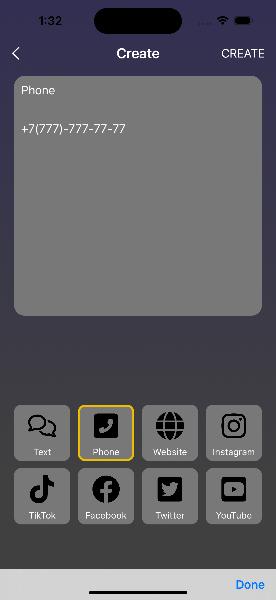
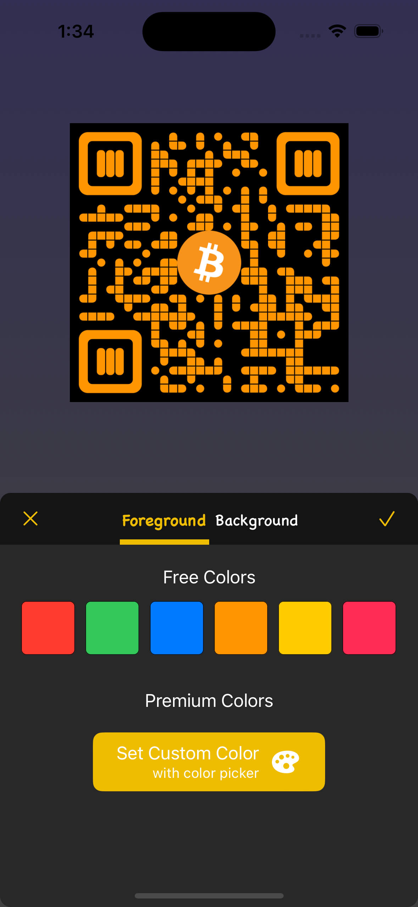
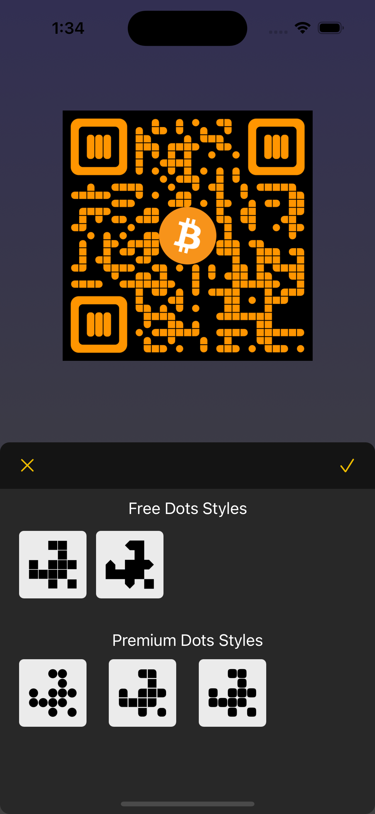
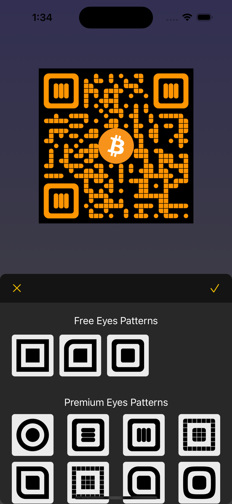
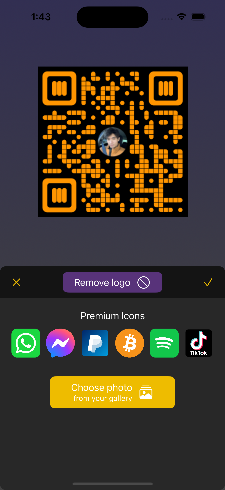
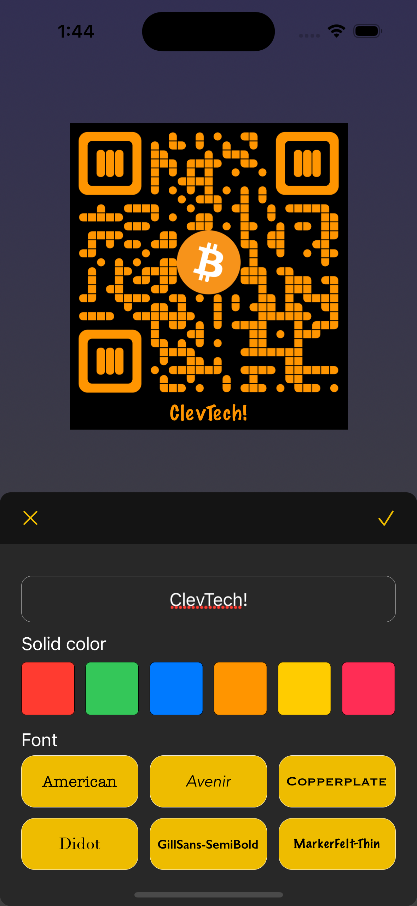
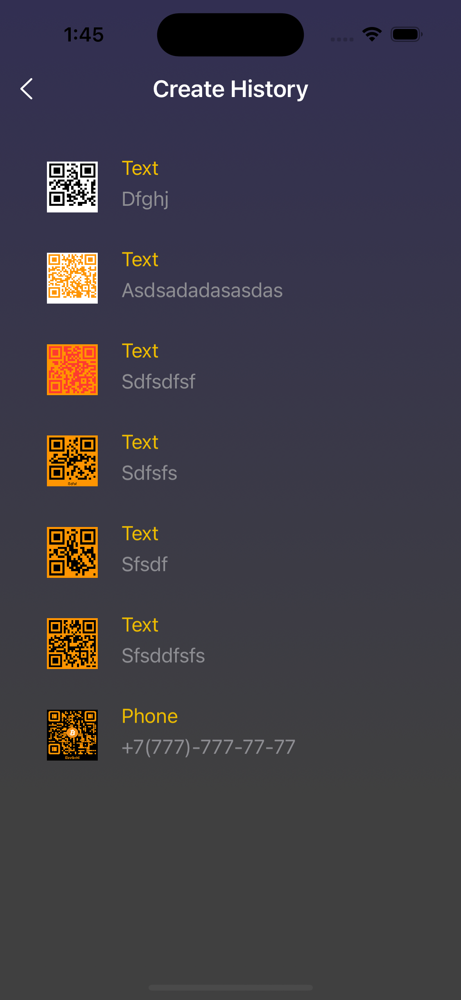
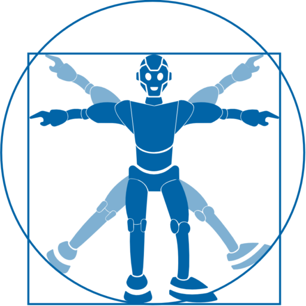

# QR Generator App

QR generator app written in Swift 5 which offers a wide range of customization options of your QR code, allowing you to choose from various shapes, colors, and designs to match your branding, personal or business style.

## Screenshots

 
 
 
 

## How to run

### Requirements

1. Xcode 13.0+
2. Cocoapods 1.9.0+

### Getting started

1. Clone this repository.
2. Via the CLI, go to the root folder of the project where Podfile is located and run `pod install`.
3. Open the workspace file and you are ready to go.

## First-party libraries

### QRCode (https://github.com/dagronf/QRCode/)
A simple and quick macOS/iOS/tvOS/watchOS QR Code generator/detector library for SwiftUI, Swift and Objective-C.

## Third-party libraries

### SnapKit (https://github.com/SnapKit/SnapKit)
SnapKit is a DSL to make Auto Layout easy on both iOS and OS X.

### Realm (https://github.com/realm/realm-swift)
Realm is a mobile database that runs directly inside phones, tablets or wearables.

## Credits
* Application is made by [Cleverest Technologies](https://www.flaticon.com/authors/simpleicon)

